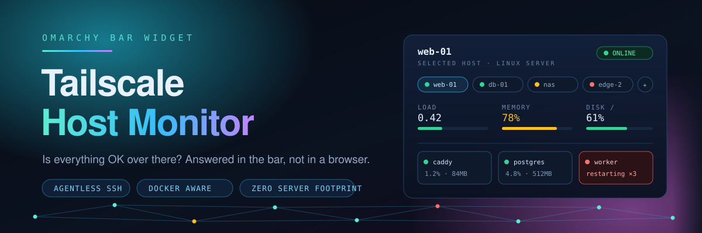
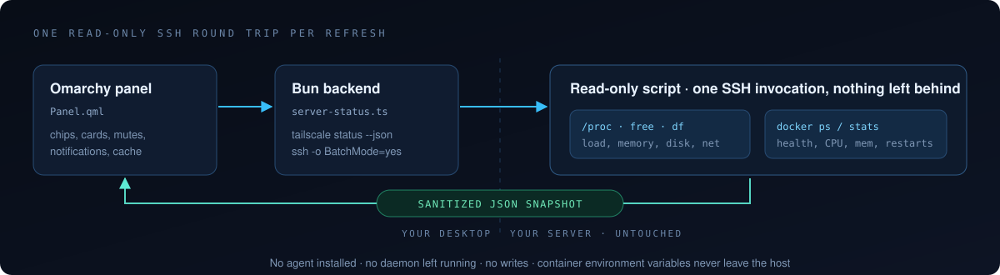
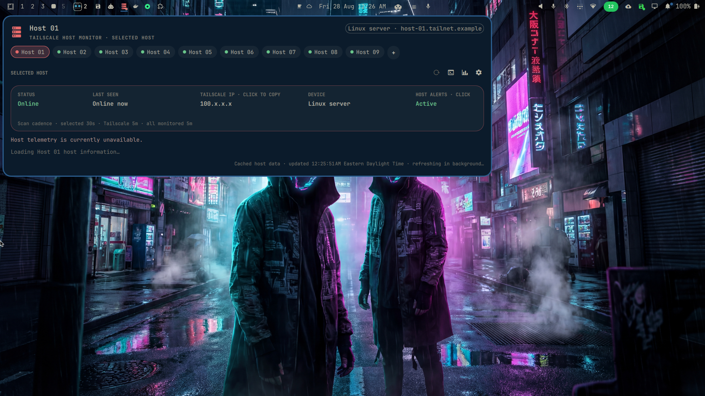

<div align="center">



# Tailscale Host Monitor

**Your whole tailnet, one dot in the bar. Green means go.**

[](https://omarchy.org)
[](https://tailscale.com)
[](https://bun.sh)
[](#how-it-works)
[](./LICENSE)

</div>

---

You run a couple of VPSes, a homelab box, maybe a small Docker or Podman product. You do
not run Prometheus, and you should not have to open a browser tab to answer the
only question you actually ask all day:

> **Is everything OK over there?**

This is a bar widget that answers it. Load, memory, per-disk usage, network
rate, uptime, and every Docker or Podman container's health and resource usage — one
click from the Omarchy bar, with desktop notifications when something crosses a
threshold. It complements a real monitoring stack rather than replacing one: no
history, no time series, no server-side storage. Just the current truth, on
demand.

## Tailscale-centric by design

The node list *is* your tailnet. There is no hosts file to hand-maintain, no
inventory to keep in sync, no exporter to deploy.

- Discovery reads `tailscale status --json` from the **local** Tailscale daemon.
  It does not ping, probe, or SSH your tailnet to find devices.
- **You pick the nodes.** Click to add or remove; only what you select shows up
  in the dashboard. Offline nodes stay selectable.
- **Every device type is honest about itself.** Linux nodes get deep telemetry
  over SSH. Macs, Windows, iOS, and Android nodes show what Tailscale actually
  knows — presence, address, DNS name, device type, tags, last seen — and do not
  pretend to have metrics they cannot provide.
- Tailscale is the addressing layer, so it works the same whether the box is in
  your closet or in another hemisphere.

## How it works



Agentless, and not in the marketing sense: every Linux telemetry refresh is
**one read-only SSH round trip**. Nothing is installed, written, or left
running on your servers. Remove the plugin and there is nothing to clean up
remotely, because nothing was ever put there.

The remote script reads `/proc`, `free`, and `df` for host metrics, then
collects **Docker and Podman independently** (`ps / stats / inspect`, including
rootless Podman) so a host running both engines shows both sets. If the
`docker` CLI is actually Podman, that pass is skipped so the same containers
are not listed twice. **KVM/libvirt** domains come from read-only `virsh
dominfo` on `qemu:///system` and `qemu:///session`. Hosts with none of those
simply show host metrics — the containers column appears only when something
exists. `inspect` / `dominfo` stay narrow: full inspect JSON and domain XML
would leak secrets into the snapshot.

## What it looks like



*Privacy mode on — hostnames, addresses, and DNS names masked for screen
sharing. Toggle it off and these are your real nodes.*

## Features

- **Host metrics** — CPU load, memory, per-disk usage, network rate, uptime,
  with traffic-light thresholds (memory warns at 75%, red at 85%; disk warns
  at 70%, red at 80%; load per core warns at 0.7, red at 1.0, judged on the
  **5-minute** average — see [the observer effect](#the-observer-effect-load-spikes-caused-by-monitoring-itself));
  read-only ISO media is ignored because a full optical image is not
  actionable capacity
- **Containers and VMs** — compact three-column cards show Docker, Podman, and
  KVM/libvirt guests together (runtime on the detail line), with health, CPU%, memory versus its
  limit, restart count; unhealthy, restarting, or OOM-killed turns red
- **One card per filesystem, not per mount** — btrfs subvolumes and bind mounts
  share a single allocation pool and `df` reports identical figures for each, so
  `/`, `/home`, `/var/log`, and `/.snapshots` on one btrfs partition collapse
  into a single card labelled `Disk / +3`, instead of raising the same warning
  four times over; hover the card to see every mount in the group. Separate
  partitions stay separate cards, and the
  fullest member of a group is the one reported, so a subvolume quota cannot
  hide a filesystem that is closer to full than its primary mount
- **Multiple servers** — small chips switch between selected hosts; drag them
  to persist a new `monitoredHosts` order; the full bar icon and its status dot
  use green/yellow/red for the worst unmuted state across all selected hosts
- **Selected-host workspace** — the chosen host stays selected across shell
  reloads; status, last seen, Tailscale IP, device type, host metrics, and
  containers are arranged around that host instead of the discovery list
- **Direct actions** — click the selected host's Tailscale IP to copy it;
  warning cards expose a visible MUTE/MUTED toggle stored per host without
  hiding or recoloring the underlying data; click any monitored-machine chip
  to inspect its dashboard, right-click it to connect in the default terminal,
  or drag it to reorder
- **Whole-host mute** — click **HOST ALERTS** in the focused-host status box to
  suppress that host's notifications and exclude its failures from the bar
  color; its live and cached information remains fully visible
- **Trustworthy startup sweep** — startup stays green while the nodes selected
  on the previous run are checked sequentially, with two seconds between SSH
  connections; warnings, red status, and notifications begin only after the
  complete selected set has been evaluated
- **No inner scrolling** — the popup follows its content height, switches to
  denser metric/container grids when necessary, and replaces the dashboard
  with the node manager while that manager is open
- **Persistent host cache** — the latest safe snapshot for every host is kept
  in `~/.cache/omarchy-server-status-snapshots.json`; cached cards appear
  immediately after a shell/plugin reload and remain visible during refresh
- **Desktop notifications** — `notify-send` on threshold breaches, container
  failures, unreachable hosts, and recoveries
- **Theme-aware status colours** — the traffic lights follow the active Omarchy
  theme's own green, yellow, and red, alongside the foreground, accent, and
  border colours the panel already derived from it. The theme palette is
  measured before it is trusted: a theme whose colours are mutually
  indistinguishable, too close to the panel background, or outside the hue range
  that reads as their role keeps the built-in triple instead. Some real themes
  need this — hackerman defines red as `#50f872`, which is green, and
  matte-black defines green as amber and yellow as red, so adopting either
  verbatim would report a failing host as healthy
- **Privacy mode** — mask hostnames, addresses, DNS names, container names, and
  remote error text for screenshots and screen sharing, with zero effect on
  what is collected or how health is judged
- **About row** — the last line of the panel carries the plugin name and
  version, with links to the repository and to [nixfred.com](https://nixfred.com);
  hover a link to see where it goes

## Requirements

- Omarchy Shell with third-party plugin support
- [Bun](https://bun.sh) 1.2 or newer on the desktop (only long-stable
  `Bun.spawn` / `bun test` APIs are used)
- Passwordless SSH to each server (key-based; the backend runs with
  `BatchMode=yes`, so password prompts fail closed)
- For container metrics, the remote account needs `sudo -n docker` or
  membership in the `docker` group, and/or a working `podman` for that
  same account (rootless user Podman is enough). For KVM VMs, `virsh` must
  work as that user (`qemu:///session`) or via `sudo -n virsh` (`qemu:///system`).
  Host metrics work without any of those.

## Install

```bash
omarchy plugin add https://github.com/nixfred/omarchy-server-status --enable --yes
```

Or from a local clone:

```bash
omarchy plugin validate ~/path/to/omarchy-server-status
omarchy plugin add file://$HOME/path/to/omarchy-server-status --enable --yes
```

## Remove

```bash
omarchy plugin remove io.github.nixfred.tailscale-host-monitor
```

This unregisters the plugin and deletes its installed files. The selected-node
list remains in `~/.config/omarchy/server-status.json`; delete that file too if
you want a fully clean slate. Nothing was ever installed on the monitored
servers, so there is nothing to clean up remotely.

## Selecting nodes

1. Open the panel and click the small **+** beside the monitored-host chips.

2. Click any online or offline node to toggle it. The selection is stored in
   `~/.config/omarchy/server-status.json` and does not reload the shell.

3. For deep Linux telemetry, make sure the selected node accepts key-based SSH.
   A matching alias in `~/.ssh/config` can provide a custom user or identity:

   ```ssh-config
   Host web-1
       HostName 203.0.113.10
       User ops
       IdentityFile ~/.ssh/id_ed25519
       IdentitiesOnly yes
   ```

Click a selected node's chip, or press `1`–`9`, to inspect that node in the
dashboard. Right-click the chip to open SSH in the default terminal. The chosen
host is stored with the selection and remains focused across
shell/plugin reloads until you choose another one. The bar dot always shows the
worst state across the selected nodes.

Host snapshots are cached in memory and on disk. Switching to a host whose
snapshot is newer than the selected-host scan cadence reuses that snapshot
without another SSH request. When a snapshot is stale, the cached card remains
onscreen while one background request replaces it atomically. Manual refresh
always forces a fresh sample. The cache contains only the already-sanitized
snapshot, is restricted to the current user (`0600`), and never stores
container environment variables or SSH credentials.

Drag a monitored-host chip over another chip and release to change its position.
The chip follows the pointer as a raised drag ghost, while the destination
shows an insertion bar and expands slightly. The new order is written immediately to the `monitoredHosts` array in
`~/.config/omarchy/server-status.json` and is used after every reload.

## Muting without lying to yourself

Click the Tailscale IP in the selected-host box to copy it with `wl-copy`.
When a host metric or container is warning/failing, its card shows **MUTE**.
Clicking the card records that warning ID under the selected host's
`mutedWarnings` entry and removes it only from host-color and notification
rollups. The card keeps its actual value, detail, health state, and warning
color while showing **MUTED**. Click it again to restore alerting.

For a host-wide maintenance window, click **HOST ALERTS** in the selected-host
status box. A muted host stays in the dashboard with all of its real data, but
does not send notifications or contribute yellow/red to the bar icon. Click
the field again to re-enable alerting. Host-wide mutes are stored in the
`mutedHosts` array in `~/.config/omarchy/server-status.json`.

Muting suppresses the alert, never the number. A muted card stays the color of
its real state, so a maintenance window cannot quietly become a blind spot.

## Scan cadences

Scanning is split into three independent schedules. By default, the selected
host receives one read-only SSH telemetry request every 30 seconds while the
panel is open. `tailscale status --json` reads presence from the local Tailscale
daemon every 5 minutes; it does not ping or SSH every tailnet node. Selected
Linux hosts receive a background SSH sweep every 5 minutes for status dots and
notifications. At startup the previously selected Linux hosts are placed in a
single SSH queue, processed one at a time with a two-second pause between
connections. The monitor remains green and suppresses startup alerts until the
entire selected set has been checked.

Each schedule has fixed presets and a Custom option with a seconds field in the
plugin settings. The current effective cadences are also printed in the
selected-host status box. Manual refresh (`r`) refreshes the selected host and
Tailscale presence immediately; `R` also requests every selected Linux host.

## Shortcuts

| Key   | Action                          |
| ----- | ------------------------------- |
| `r`   | Refresh the focused host        |
| `R`   | Refresh every host              |
| `T`   | Open an SSH terminal            |
| `B`   | Open btop/htop/top over SSH     |
| `E`   | Edit the monitored-node selection file |
| `1–9` | Switch host                     |
| `Esc` | Close the panel                 |

Bar icon: green means every selected host is healthy, yellow means a warning
or telemetry is still unknown, and red means a critical condition or offline
node. Middle-click refreshes all hosts. Right-click closes the monitor and
opens an SSH terminal to the focused host on the current workspace.

## Settings

| Key                     | Default      | Description |
| ----------------------- | ------------ | ----------- |
| `sshHosts`              | *(empty)*    | Legacy seed used on first run; use the in-panel picker afterward |
| `hostScanPreset`        | `30 seconds` | Selected-host SSH cadence while open |
| `customHostScanSec`     | `30`         | Seconds used when selected-host cadence is Custom |
| `tailnetScanPreset`     | `5 minutes`  | Local Tailscale daemon discovery cadence |
| `customTailnetScanSec`  | `300`        | Seconds used when Tailscale cadence is Custom |
| `allHostsScanPreset`    | `5 minutes`  | Background SSH sweep cadence across selected Linux hosts |
| `customAllHostsScanSec` | `300`        | Seconds used when all-host cadence is Custom |
| `panelWidth`            | `1000`       | Popup width in layout units |
| `privacyMode`           | `false`      | Mask identifying details for screenshots and screen sharing |

Privacy mode changes presentation only. Collection, selection, health state,
copy/SSH targets, and cached snapshots continue to use the real node data.

## Diagnosing

Run the collector outside Omarchy to inspect the raw snapshot:

```bash
bun run backend/server-status.ts status --host <ssh-alias>
```

## The observer effect: load spikes caused by monitoring itself

Opening an SSH session is not free on the host being measured. PAM session
hooks and `/etc/update-motd.d/` scripts run on connect, and on a well-equipped
server those can mean `fail2ban-client status`, `podman ps`, `incus list`,
`df`, `free`, and a couple of log greps — all firing at once, concurrently
with this plugin's own `docker`/`podman` `ps` / `stats` / `inspect` calls.

That is ten to fifteen short-lived processes inside a two-second window. On a
2–4 core VM it is enough to fill the kernel run queue, and a `/proc/loadavg`
sample taken inside that burst reports a host that is actually idle as
`CPU load 100%` — followed moments later by a recovery notification once the
burst clears.

**The plugin judges the 5-minute average rather than `load1` for this reason.**
A debounce would not have helped: the spike is caused by our own connection, so
it recurs on every refresh instead of flapping at random. Only a longer
averaging window rejects a two-second burst, and genuine sustained load still
crosses the threshold within a couple of scans. All three averages stay visible
on the card (`1m 5.19 · 5m 0.41 · 15m 0.22`), so you can see the spike happening
without being alerted about it.

If a host still reports load you cannot account for, time the login path
directly:

```bash
time ssh -o BatchMode=yes <host> true
```

A connection that takes noticeably longer than the network round trip is doing
work at session open. `run-parts --test /etc/update-motd.d` lists what runs
there. Making those scripts cheaper, or moving the expensive ones out of the
login path onto a timer, reduces the disturbance for every tool that connects —
not just this one.

Diagnosed by [@kanthi](https://github.com/kanthi) in
[#1](https://github.com/nixfred/omarchy-server-status/pull/1), with `sar -q`
evidence from a 4-vCPU Azure VM.

## Development

```bash
bun run check              # tests + build
omarchy plugin validate .
```

## Theming

Colours come from the active theme wherever a theme can supply them. Chrome —
text, dim text, borders, tile fills, the accent — reads from the shell's `Color`
singleton and follows a theme switch immediately.

Status colours are the exception, because they carry meaning rather than style.
The shell's `Color` singleton parses the theme's `colors.toml` but keeps only
`foreground`, `background`, `accent`, `muted`, and `urgent`; `green` and
`yellow` are read and discarded. The panel therefore reads `colors.toml`
directly, watches it for changes, and re-reads it when the popup opens.

Every theme palette is checked before it is used. A theme keeps its own colours
when the three are distinguishable from each other and from the background, are
not effectively grey, and each sits in the hue range that reads as its role.
Otherwise the built-in `#69c58a` / `#e5b45d` / `#e66a6a` triple stands in. Of
the themes shipped with Omarchy, most pass; the ones that do not are rejected
for concrete reasons, such as hackerman defining red as a green or lumon giving
three near-identical blues. `ThemePalette.js` holds the logic and the tests
exercise it against every theme installed on the machine.

## Security notes

- The remote script is read-only; the plugin never mutates server state.
- Snapshots exclude container environment variables by design.
- **Remote strings are never rendered as markup.** Hostnames, DNS names,
  container names, and SSH error text arrive from monitored hosts. Qt's default
  `Text.AutoText` sniffs a string and renders anything markup-shaped as rich
  text, which would let a hostname containing `` make the
  shell process fetch a remote URL. Every `Text` in the panel pins
  `textFormat: Text.PlainText`, and a test asserts the count of pinned elements
  equals the count of elements so the invariant cannot quietly rot. Strings
  bound for shell-owned sinks the plugin cannot pin — tooltips, the panel hero,
  `notify-send` — are stripped of markup characters, C0/C1 and bidi controls,
  and length-capped first.
- **Remote output is bounded at the producer.** A host is read under an explicit
  byte budget (1 MiB stdout, 16 KiB stderr for SSH; 4 MiB for `tailscale
  status`), and an oversized stream kills the child and becomes a reported error
  rather than memory pressure in the shell. Cardinality is capped too: 256
  containers, 64 disks, 512 tailnet devices.
- SSH runs with `BatchMode=yes`, so a host that would prompt for a password
  fails closed instead of hanging the panel.
- The on-disk snapshot cache is `0600` and holds only sanitized data.
- Use a dedicated, restricted SSH identity if you want the panel's key to be
  unable to do anything beyond reading status.

## Credits

The agentless core of this plugin — the read-only SSH collector, the Docker
metrics parsing, and the narrow `docker inspect` format string that keeps
container environment variables out of every snapshot — is the original work of
**[ryu](https://github.com/ryuhzk)**. The Tailscale discovery layer, node
selection, per-warning and per-host muting, the snapshot cache, and the
scheduling model were built on top of that foundation.

Built against the [Omarchy](https://omarchy.org) Shell plugin API and rendered
with [Quickshell](https://quickshell.outfoxxed.me).

> Not affiliated with, endorsed by, or sponsored by Tailscale Inc. This is an
> unofficial third-party tool that reads the output of the `tailscale` CLI on
> your own machine. Tailscale is a trademark of Tailscale Inc.

## License

[MIT](./LICENSE)
